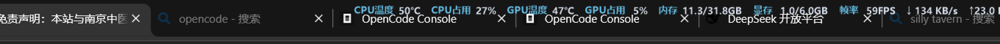

# SysMonitorBar

[中文说明](README.md) ｜ **English**

A tiny always-on-top bar at the **top center of your screen** showing live hardware stats in 1–2 lines.
Pick exactly which metrics to show, click right through it, and it fades out of the way when you hover.

Windows 10/11 · .NET 8 · WinForms · [MIT License](LICENSE)


```
        CPU温度 48°C   CPU占用 14%   GPU温度 45°C   GPU占用 2%
内存 12.3/31.8GB   显存 0.9/6.0GB   帧率 41FPS   ↓ 14.4 KB/s  ↑ 1.60 MB/s
```

> The UI is currently **Chinese-only**. The program works fine on any Windows locale — only the labels are Chinese, and every label can be renamed to anything you like from the settings window.

## Features

- **CPU** — temperature (reads MSR via LibreHardwareMonitor, falls back to the ACPI thermal zone when that isn't available), load, clock, package power, fan speed
- **GPU** — temperature, hot spot, load, power, fan speed, VRAM usage. Uses NVAPI, so it works **without administrator rights**
- **Memory** — RAM used/total, VRAM used/total
- **Network** — live download/upload rate, automatically picking the busiest NIC (or pin a specific one / sum them all)
- **Display** — current refresh rate, plus **measured** real-time frame rate via the DXGI Desktop Duplication API
- **Any sensor** — every sensor LibreHardwareMonitor can enumerate (per-core clocks, voltages, motherboard and drive temperatures, …) can be added to the bar individually
- **Full control over the layout** — which metrics appear, which line they sit on, their order, their display name and their text template are all edited in a proper settings window
- **Transparent background** — the background opacity slider goes all the way down to 0 %, leaving **nothing but the text floating on your desktop**. Rendering uses per-pixel alpha, so the text stays perfectly crisp
- **Never in the way** — mouse click-through is on by default; the bar fades down to 15 % opacity while your cursor is over it
- **Tray resident** — drag to reposition, quick font-size up/down, and start-with-Windows (creates a scheduled task so it launches elevated **without a UAC prompt**)

Hovering makes it fade away:


With the background at 0 % — the text sits directly on top of the browser tab strip, no plate at all:



## Download

Grab the latest ZIP from [Releases](https://github.com/leerogerstheman/SysMonitorBar/releases), extract it, then double-click `启动-管理员.cmd` (*Start as administrator*).

**Requirement:** [.NET 8 Desktop Runtime](https://dotnet.microsoft.com/download/dotnet/8.0) — the *Runtime*, not the SDK.

## Build from source

```bat
git clone https://github.com/leerogerstheman/SysMonitorBar.git
cd SysMonitorBar
build.cmd
```

`build.cmd` needs the **.NET 8 SDK** and locates it automatically. If your SDK lives somewhere unusual, create a `dotnet-path.txt` in the project root containing the full path to `dotnet.exe` (this file is git-ignored).

The launcher scripts:

| File | Purpose |
|---|---|
| `启动-管理员.cmd` | Start elevated (recommended) — UAC prompt |
| `启动.cmd` | Start without elevation |
| `设置.cmd` | Open the settings window |
| `退出.cmd` | Stop the program |
| `build.cmd` | Rebuild into `app\` |

## Settings

The settings window has three tabs:

- **显示内容** (*Content*) — pick metrics on the left, move them into line 1 or line 2, reorder them, and edit each one's display name and text template
- **外观** (*Appearance*) — font family/size/bold, text and accent colours, background colour, **background opacity**, corner radius, paddings, separator, overall opacity, and the hover-fade opacity
- **位置与行为** (*Position & Behaviour*) — refresh interval, which monitor, X/Y offset, click-through, auto-hide unavailable metrics, NIC selection, start with Windows

There are two opacity sliders and they do different things:

| Slider | Range | Effect |
|---|---|---|
| **Background opacity** | 0–100 % | Affects **only the plate**. At 0 % the plate is gone entirely and only the text remains |
| **Overall opacity** | 20–100 % | Fades **the text as well** |

They multiply. For a HUD-style "text only, no background" look, set the background opacity to 0 % —
the text stays fully opaque and legible.

The background is rendered with **per-pixel alpha**, so a semi-transparent bar is genuinely
translucent (you can see the window behind it), the rounded corners stay anti-aliased against a
transparent backdrop, and the text is drawn with grayscale anti-aliasing — ClearType sub-pixel
anti-aliasing would produce colour fringing on a transparent background.

Templates support `{label}`, `{value}` and `{unit}`, so a template of `CPU {value}{unit}` with the label `CPU` renders as `CPU 62°C`.

## Known limitations

These are all described in more detail (with measurements) in the [Chinese README](README.md):

- **CPU temperature** — reading MSR requires administrator rights *and* a kernel driver that loads successfully. When neither works, the app falls back to the ACPI thermal zone, which needs no elevation. The fallback tracks the board sensor rather than the die, so it reads a little lower and reacts more slowly.
- **Fan speeds** — only appear if your hardware actually exposes them. Many laptops (including the one this was developed on) report no fan sensor at all; `nvidia-smi --query-gpu=fan.speed` returning `[N/A]` is normal for laptop GPUs.
- **Real-time frame rate** — measured with DXGI Desktop Duplication. It is clamped to the refresh rate, reads `0` while the desktop is completely static, and cannot be measured in exclusive-fullscreen games or over a remote-desktop session. Use the *refresh rate* metric if you want a number that is always available.
- **Click-through** honours the *Drag to reposition* tray mode: that mode turns it off temporarily, otherwise the bar could not be grabbed.

## How it works

| Concern | Implementation |
|---|---|
| CPU / GPU / motherboard sensors | [LibreHardwareMonitorLib](https://github.com/LibreHardwareMonitor/LibreHardwareMonitor) 0.9.6 |
| CPU temperature fallback | `Win32_PerfFormattedData_Counters_ThermalZoneInformation` via WMI — no elevation needed |
| Frame rate | DXGI Desktop Duplication through [Vortice](https://github.com/amerkoleci/Vortice.Windows) (Direct3D 11 / DXGI bindings) |
| Memory | `GlobalMemoryStatusEx` |
| Network | `NetworkInterface.GetIPStatistics()` deltas |
| Refresh rate | `EnumDisplaySettings` (with a `GetDeviceCaps(VREFRESH)` fallback) |
| The bar itself | Borderless topmost `Form`, `WS_EX_TOOLWINDOW \| WS_EX_NOACTIVATE \| WS_EX_LAYERED`, `WS_EX_TRANSPARENT` for click-through |
| Transparent background | `UpdateLayeredWindow` with a `Format32bppPArgb` bitmap — true per-pixel alpha; text is drawn with GDI+ `DrawString` and grayscale anti-aliasing |

Source layout and the debugging notes I wish I'd had (COM object lifetimes, `CreateParams` gotchas, batch-file encodings) are in the [Chinese README](README.md#五技术实现).

## License

[MIT](LICENSE)
